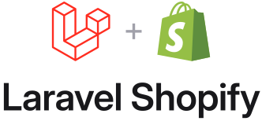
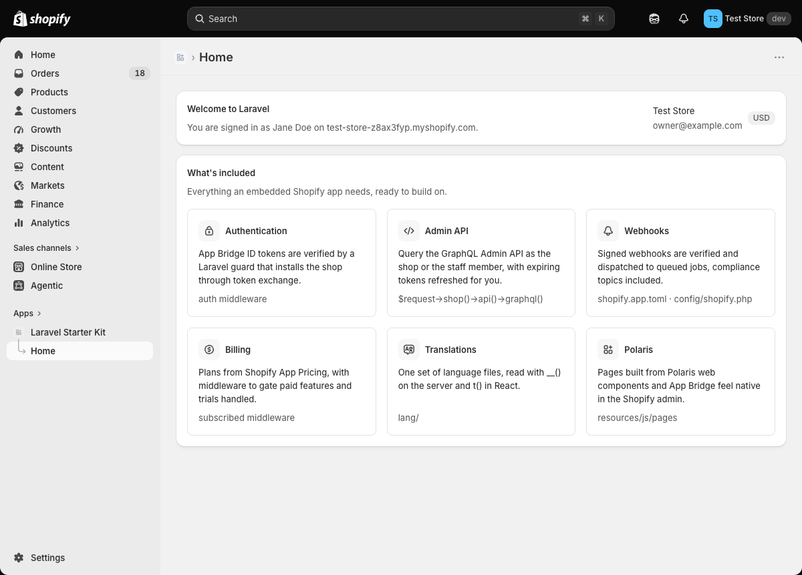

<p align="center">
  <picture>
    <source media="(prefers-color-scheme: dark)" srcset=".github/art/logo-dark.svg">
    
  </picture>
</p>

<p align="center">
  <a href="https://github.com/portside-labs/laravel-shopify/actions/workflows/tests.yml"></a>
  <a href="https://packagist.org/packages/portside-labs/laravel-shopify"></a>
  <a href="LICENSE"></a>
</p>

## About Laravel Shopify

A starter kit for building embedded Shopify apps the Laravel way: Laravel, Inertia, and React, with pages built from Shopify's Polaris web components so they feel native in the admin.

<p align="center">
  
</p>

## What's included

- **Authentication as a Laravel guard.** App Bridge ID tokens are verified on every request. `$request->user()` is the staff member, `$request->shop()` is their store, and routes are protected with `auth`.
- **Managed installation and token exchange.** No OAuth redirects. Offline tokens (the shop) and online tokens (the staff member) are exchanged, stored, and refreshed automatically, and a revoked token makes the app reinstall itself.
- **Webhooks as queued jobs.** Deliveries are verified and dispatched by topic. The compliance topics, `app/uninstalled`, and `app/scopes_update` are set up.
- **Polaris and App Bridge.** The admin's sidebar, loading bar, and toasts are wired to Inertia.
- **Translations.** One set of files in `lang/`, read with `__()` on the server and `t()` in React.
- **Billing through Shopify App Pricing.** A `subscribed` middleware and a Cashier-like API on `Shop`.
- **Artisan commands** to link the app, check its configuration, generate webhook jobs, and send test webhooks.
- **Tests, static analysis, and formatting** for all of the above.

## Requirements

- PHP 8.3+, Composer, and Node.js 22+
- [Shopify CLI](https://shopify.dev/docs/api/shopify-cli)
- A [Dev Dashboard](https://dev.shopify.com/dashboard) account and a development store

## Getting started

```bash
composer create-project portside-labs/laravel-shopify my-app
cd my-app
npm install
```

1. Create an app in the Dev Dashboard.
2. Link it and pull its credentials into `.env`:

    ```bash
    php artisan shopify:install
    ```

    This runs `shopify app config link` and `shopify app env pull`, then checks the configuration. If linking dropped the webhook subscriptions from `shopify.app.toml`, restore them from git.

3. Set your access scopes in `shopify.app.toml` and release the configuration:

    ```bash
    shopify app deploy
    ```

4. Start the app:

    ```bash
    shopify app dev
    ```

    The CLI opens a tunnel, runs `composer run dev` (server, queue worker, and Vite), and prints a link that installs the app on your development store.

## Artisan commands

| Command                              | What it does                                                                                                                                                     |
| ------------------------------------ | ---------------------------------------------------------------------------------------------------------------------------------------------------------------- |
| `shopify:install`                    | Links the app and writes its credentials to `.env`.                                                                                                              |
| `shopify:doctor`                     | Checks credentials, URLs, API version, webhooks, and billing settings. Fails on errors, so it can run in CI.                                                     |
| `make:shopify-webhook orders/create` | Creates the job and a test, maps the topic in `config/shopify.php`, and subscribes to it in `shopify.app.toml`.                                                  |
| `shopify:webhook orders/create`      | Sends a signed webhook to the app in-process, with no tunnel needed. Use `--sync` to run the job immediately and `--payload=file.json` to send your own payload. |

## Using the kit

### Admin API

```php
$request->shop()->api()->graphql('{ shop { name } }')->json('data.shop');
```

`Shop::api()` acts as the shop. `User::api()` acts as the staff member, limited to their permissions. Both use Laravel's HTTP client, so `Http::fake()` works in tests.

### Webhooks

Every webhook goes to `/webhooks` and is dispatched to the job mapped to its topic in `config/shopify.php`. Add one with `php artisan make:shopify-webhook {topic}`, then run `shopify app deploy`. Jobs receive the `Shop` and the payload.

### Translations

Put every string in `lang/` and read it with `__()` or `t()`, using Laravel's `:placeholder` and `singular|plural` syntax on both sides:

```tsx
const { t } = useTranslation();

t('home.welcome', { app: name });
t('orders.count', { count: 3 }); // "{0} No orders|{1} One order|[2,*] :count orders"
```

The staff member's admin language is picked up from Shopify. To add a language, translate `lang/{locale}` and add the locale to `app.locales` in `config/app.php`.

### Billing

Plans are configured in the Partner Dashboard and sold by Shopify. Add to `.env`, using a Partner API client with the "Manage apps" permission:

```dotenv
SHOPIFY_APP_ID=1234
SHOPIFY_PARTNER_ORGANIZATION_ID=12345
SHOPIFY_PARTNER_ACCESS_TOKEN=prtapi_...
```

Gate routes with `subscribed`, or `subscribed:pro` for a specific plan:

```php
Route::get('/reports', ReportController::class)->middleware('subscribed');
```

Shops without a plan are sent to Shopify's plan selection page. Set each plan's welcome link to `/billing/welcome`. Check plans in code with:

```php
$shop->subscribed();          // any active plan
$shop->subscribed('pro');     // a specific plan
$shop->onTrial();
$shop->subscription()?->plan;
```

Shopify sends no webhook when a subscription changes, so the plan is cached for five minutes. Development stores can take any plan for free.

### Building pages

- Add pages to `resources/js/pages`, built from Polaris web components. Link to routes with Wayfinder (`resources/js/routes`).
- Register routes in `routes/web.php` behind `auth`.
- Authorize with policies using `$user->account_owner`, `$user->collaborator`, and `$user->scopes`.
- Show a toast from any controller with `Inertia::flash('toast', 'Saved.')`.
- Listen for `App\Events\ShopInstalled` and `ShopUninstalled` for onboarding and cleanup.
- Run `composer test` (Pint, PHPStan, tests) and `npm run check` (frontend lint and format).

## Deploying

- Serve over HTTPS and run a queue worker.
- Set `APP_URL`, `SHOPIFY_API_KEY`, `SHOPIFY_API_SECRET`, and the billing variables if you sell plans.
- Point `application_url` and `redirect_urls` in `shopify.app.toml` at your domain, then run `shopify app deploy`.
- Run `php artisan shopify:doctor` to catch misconfiguration. It also warns when `SHOPIFY_API_VERSION` is nearing the end of support.

## Working with AI agents

`CLAUDE.md` describes the kit's conventions for Claude Code. `.mcp.json` registers the Shopify Dev MCP server, and Laravel Boost adds Laravel tooling.

## License

MIT. See [LICENSE](LICENSE).
